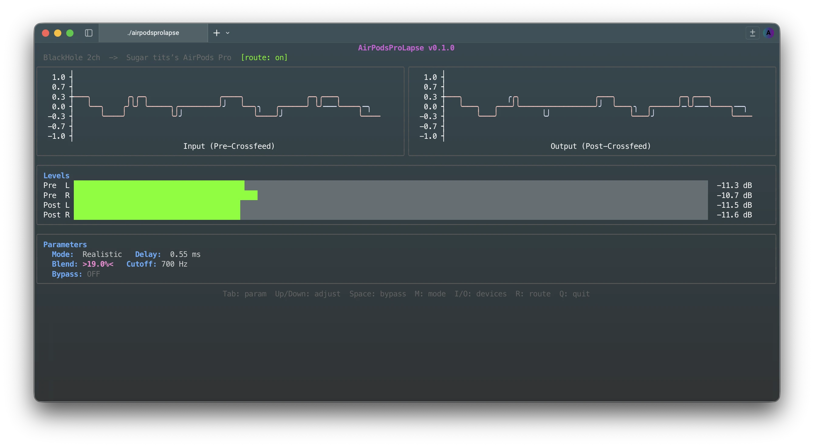

# AirPodsProLapse



headphones lie to you. they pipe left into your left ear and right into your right ear and call it a day. real speakers don't work like that — your left ear hears a bit of the right speaker too, slightly delayed, slightly muffled by your head. that's what makes music sound like it's *in a room* instead of *inside what your mum apparently calls your unusually thick head*.

this fixes that. it sits between your system audio and your headphones, blending a little of each channel into the other. simple mode just mixes. realistic mode adds a tiny delay and a low-pass filter to fake the head shadow thing. you can tweak it all live in the terminal while music plays.

designed in my head, built in claude. loved by audiophiles and hopefully not the other kind of phile.

## you need

```bash
brew install portaudio blackhole-2ch
```

[BlackHole](https://existential.audio/blackhole/) is the virtual audio device that captures your system audio. portaudio is the C library that talks to it.

## install

```bash
go install github.com/0xdeafcafe/AirPodsProLapse@latest
```

or just build it:

```bash
go build -o airpodsprolapse .
```

## run

```bash
./airpodsprolapse
```

that's it. picks your devices interactively, sets up the audio routing automatically, restores everything when you quit.

if you're into flags:

```bash
./airpodsprolapse --input "BlackHole 2ch" --output "AirPods Pro"
./airpodsprolapse --list-devices
./airpodsprolapse --no-auto-route
```

## how it works

```
system audio → BlackHole → AirPodsProLapse → your headphones
```

on launch it hijacks your system output to BlackHole so it can intercept everything. on exit (or crash, or ctrl+c) it puts it back. you can toggle this on/off with `R` inside the app.

## modes

**simple** — just blends. left gets some right, right gets some left. blend 0% = normal stereo, 50% = mono. start around 15%.

**realistic** — same blend but the crossed signal gets delayed (0–1ms, simulating sound traveling around your head) and low-pass filtered (simulating your skull blocking high frequencies). more convincing, slightly more cpu.

## controls

| key | what it does |
|-----|-------------|
| `Tab` | cycle through parameters |
| `Up/Down` | adjust the selected one |
| `Space` | bypass (hear the raw stereo) |
| `M` | toggle simple/realistic |
| `I` | change input device |
| `O` | change output device |
| `R` | toggle auto-routing |
| `Q` | quit |

## the tui

real-time waveforms (before and after processing), peak level meters, and a parameter panel. everything updates live. it looks nice in a terminal.
